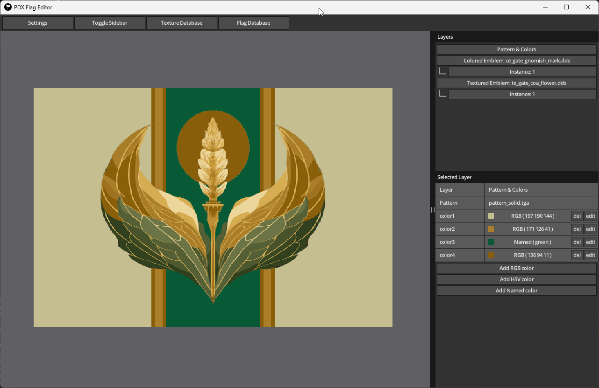

# Overview

**pdx-flag-builder** is a tool to build flags for Victoria 3 and Europa Universalis 5.

## How to Use
TODO

## How To Build
Download and install [odin](https://odin-lang.org/) including its requirements.

Then run `build.bat` (Windows) or `build.sh` (Linux) to build the application.

The resulting binary as well as the needed assets can be found in the `bin` folder.

> **NOTE** On Windows the build has to be run in the Visual Studio x64 Developer Prompt

## Credit
- waving flag by Suncheli Project from <a href="https://thenounproject.com/browse/icons/term/waving-flag/" target="_blank" title="waving flag Icons">Noun Project</a> (CC BY 3.0)