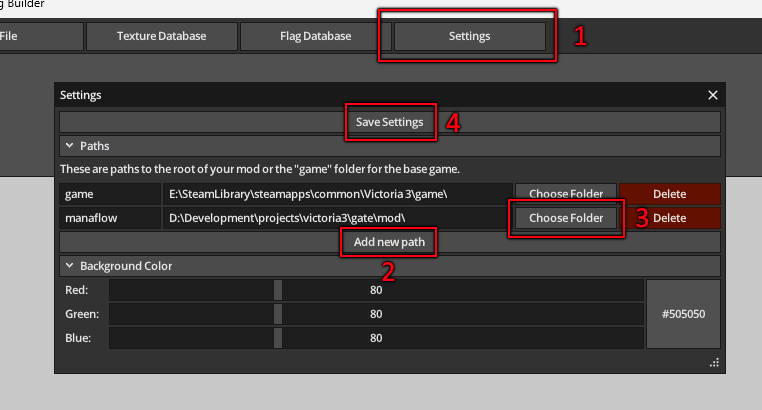

# Overview

**pdx-flag-builder** is a tool to build flags for Victoria 3 and Europa Universalis 5.

## Status

## How to Use
Download the latest version from the [releases page](https://github.com/kaiser-chris/pdx-flag-builder/releases) and then simply extract and run it.

### Setup
1) Open the settings
2) Add a new path
3) Choose the game or a mod folder
4) Save your settings

## How To Build
Download and install [odin](https://odin-lang.org/) including its requirements.

Then run `build.bat` (Windows) or `build.sh` (Linux) to build the application.

The resulting binary as well as the needed assets can be found in the `bin` folder.

> **NOTE** On Windows the build has to be run in the Visual Studio x64 Developer Prompt

## Credit
### Libraries
- [bcdec](https://github.com/iOrange/bcdec) project by [iOrange](https://github.com/iOrange)
- [nativefiledialog-odin](https://github.com/ivansouzamf/nativefiledialog-odin) project by [ivansouzamf](https://github.com/ivansouzamf)
### Images
- waving flag by Suncheli Project from <a href="https://thenounproject.com/browse/icons/term/waving-flag/" target="_blank" title="waving flag Icons">Noun Project</a> (CC BY 3.0)
- Delete by Chehuna from <a href="https://thenounproject.com/browse/icons/term/delete/" target="_blank" title="Delete Icons">Noun Project</a> (CC BY 3.0)
- edit by etika ariatna from <a href="https://thenounproject.com/browse/icons/term/edit/" target="_blank" title="edit Icons">Noun Project</a> (CC BY 3.0)
- Upload by Heztasia from <a href="https://thenounproject.com/browse/icons/term/upload/" target="_blank" title="Upload Icons">Noun Project</a> (CC BY 3.0)
- unknown by LAFS from <a href="https://thenounproject.com/browse/icons/term/unknown/" target="_blank" title="unknown Icons">Noun Project</a> (CC BY 3.0)